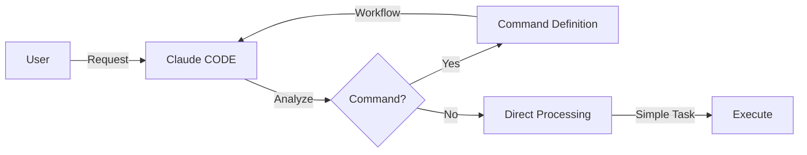
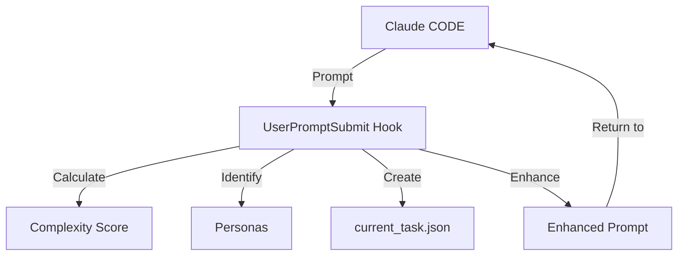
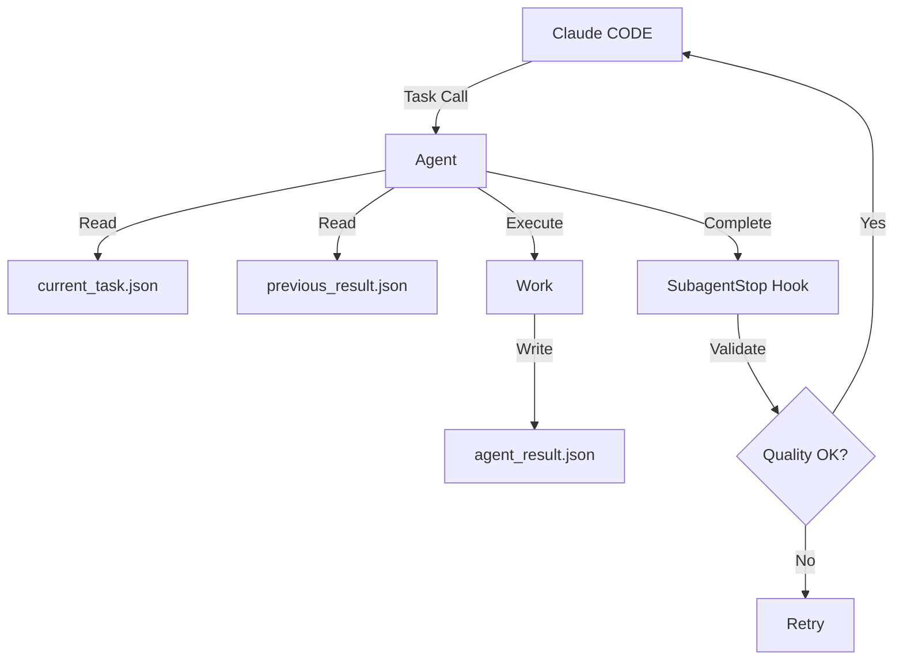

# SPARK v3.5 System Architecture

Complete architectural blueprint for SPARK's multi-agent orchestration system with lazy-loading architecture and integrated FileLockManager.

## Core Principles

### 1. Single Responsibility
Each component has ONE clear role with no overlaps or confusion.

### 2. Loose Coupling  
Components communicate through well-defined interfaces (JSON files).

### 3. Information Hierarchy
```
User Intent (Highest Priority)
    ↓
Claude CODE Interpretation  
    ↓
Hook Enhancement
    ↓
JSON State
    ↓
Agent Standards (Default)
```

### 4. Decision Authority
Only Claude CODE has decision-making power. All other components follow instructions.

---

## Component Responsibility Matrix

| Component | Primary Role | Controls | Cannot Do |
|-----------|-------------|----------|-----------|
| **Claude CODE** | Decision & Control | Task assignment, Flow control, Agent selection, Team coordination | Direct file modification |
| **5 Essential Hooks** | Automation | Context enhancement, Quality validation, Team JSON generation | Agent selection, Task creation |
| **JSON Files** | State Management | Information relay, Progress tracking, Team status, Lock coordination | Decision making |
| **16 Base Agents** | Core Execution | Actual work, Result generation, Quality validation | Calling other agents, Team coordination |
| **12 Team Agents** | Parallel Execution | Team-specific work, Lock management, Parallel coordination | Cross-team communication |
| **FileLockManager** | Resource Coordination | File lock acquisition/release, Deadlock prevention, Thread safety | File content modification |

---

## SPARK v3.5 Architecture Enhancements

### Lazy-Loading Agent System
```
Previous v3.0: Load all 16 agents → ~39K token overhead
Current v3.5: Load only required agents → ~10K token overhead
Token Savings: 75% reduction in agent loading
```

### FileLockManager Integration
```
┌─────────────────────────────────────────────┐
│              FileLockManager                │
│  ┌─────────────┐ ┌─────────────┐           │
│  │ Lock Pool   │ │ Timeout     │           │
│  │ Management  │ │ Prevention  │           │
│  └─────────────┘ └─────────────┘           │
└─────────────────────┬───────────────────────┘
                      │
      ┌───────────────┼───────────────┐
      │               │               │
┌─────▼────┐    ┌─────▼────┐    ┌─────▼────┐
│ Team 1   │    │ Team 2   │    │ Team 3   │
│ JSON     │    │ JSON     │    │ JSON     │
└──────────┘    └──────────┘    └──────────┘
```

### Hook System Streamlining
```
Previous (10 hooks) → Current (5 hooks):
✓ spark_persona_router.py    - Agent selection logic
✓ spark_phase_manager.py     - 5-Phase execution management  
✓ spark_quality_gates.py     - 8-step quality validation
✓ spark_core_utils.py        - Shared utilities
✓ file_lock_manager.py       - Thread-safe coordination (new)
```

---

## Information Flow Architecture

### Layer 1: Input Processing


### Layer 2: Context Enhancement


### Layer 3: Execution Control


---

## Execution Scenarios

### Scenario 1: Simple Task (Complexity < 0.3)
```yaml
Example: "Fix typo in README"
Flow:
  1. User → Claude CODE
  2. Claude CODE directly executes (no agent needed)
  3. Complete
Components: Only Claude CODE
Time: < 1 minute
```

### Scenario 2: Standard Command (Complexity 0.3-0.7)
```yaml
Example: "/spark-implement JWT authentication"
Flow:
  1. User → command
  2. Claude CODE reads command workflow
  3. UserPromptSubmit Hook enhances context (complexity: 0.5, personas: Backend/Security)
  4. Claude CODE → implementer-spark (reads current_task.json)
  5. SubagentStop Hook validates quality
  6. Claude CODE → tester-spark (sequential)
  7. Claude CODE → documenter-spark
  8. Complete
Components: Orchestrated pipeline
Time: 15-30 minutes
```

### Scenario 3: Parallel Execution (Complexity ≥ 0.7)
```yaml
Example: "Build complete microservices architecture"
Flow:
  1. User → complex request
  2. UserPromptSubmit Hook (complexity: 0.9, wave mode activated)
  3. Claude CODE → spawner-spark (creates team assignments)
  4. Parallel execution (SIMULTANEOUS):
     - Task(team1-implementer-spark, "auth service")
     - Task(team2-implementer-spark, "payment service")  
     - Task(team3-implementer-spark, "notification service")
     - Task(team4-implementer-spark, "gateway service")
  5. Each team works independently (cannot call other agents)
  6. SYNCHRONIZATION POINT: ALL teams must complete
  7. Claude CODE collects results (only after all complete)
  8. Integration testing and documentation
  9. Complete
Time: 30-60 minutes (slowest team determines total time)
Critical: No agent can proceed until ALL parallel agents finish
```

---

## JSON State Management

### File Categories

**Persistent Files (Cross-session)**
- `project_context.json` - Project metadata and configuration
- `quality_standards.json` - Project-specific quality requirements

**Session Files (Created/Destroyed per task)**
- `current_task.json` - Active task metadata (Hook → Agent)
- `analysis_result.json` - Analysis output (Analyzer → Next)
- `implementation_result.json` - Code created (Implementer → Tester)
- `test_result.json` - Test coverage (Tester → Documenter)

**Parallel Work Files**
- `team_coordination.json` - Overall parallel plan (Spawner → Teams)
- `team1-4_task.json` - Team assignments (Spawner → Each team)
- `team1-4_result.json` - Team outputs (Teams → Claude CODE)

### State Transitions
```
CREATE: Hook/Agent writes file
READ: Next agent consumes file
UPDATE: Hook updates status
DELETE: Claude CODE cleans up after completion
```

---

## Hook System Boundaries

### UserPromptSubmit Hook
**CAN DO:**
- Calculate complexity scores
- Identify required personas
- Create/update current_task.json
- Enhance prompt with context

**CANNOT DO:**
- Select specific agents
- Call Task tool
- Modify workflow sequence
- Make decisions

### SubagentStop Hook
**CAN DO:**
- Validate quality gates
- Block poor quality (exit code 2)
- Request retry with guidance
- Verify result JSON format

**CANNOT DO:**
- Choose next agent
- Create new tasks
- Modify workflow
- Override Claude CODE decisions

---

## Claude CODE Orchestration Authority

### Critical Architectural Constraint
**Only Claude CODE can call agents using the Task tool.**

- Agents CANNOT call other agents
- Agents CANNOT use the Task tool
- Agents must complete work independently
- All orchestration decisions belong to Claude CODE alone

### Parallel Execution Constraint
**In parallel execution, ALL agents must complete before proceeding:**

```
Team1 ─┐
Team2 ─┼─ ALL must finish → Next phase
Team3 ─┘
```

- If Team1 finishes in 5 minutes but Team2 needs 20 minutes, Team1's results wait
- Claude CODE collects results ONLY after all parallel agents complete
- No partial processing or early continuation
- Ensures consistency and prevents race conditions

### Exclusive Capabilities
1. **Task Tool Usage** - ONLY Claude CODE can call agents
2. **Flow Control** - Sequential vs Parallel decisions
3. **Result Integration** - Combining multi-agent outputs
4. **User Communication** - Interpreting and responding
5. **Dynamic Adaptation** - Handling exceptions

---

## Information Priority System

### Priority Levels (Highest → Lowest)
1. **User Direct Instruction** - "Do X specifically this way"
2. **Claude CODE Interpretation** - Task prompts with context
3. **Hook Automation** - Calculated enhancements
4. **JSON State** - Stored context and results
5. **Agent Defaults** - Standard procedures

### Conflict Resolution
```yaml
Example:
  Agent_Default: "95% test coverage required"
  User_Says: "80% is enough for this sprint"
  Resolution: User instruction wins (80%)

Principle: Specific > General, Dynamic > Static
```

---

## Implementation Patterns

### Pattern 1: Sequential Relay
```
Analyzer → Implementer → Tester → Documenter
Each reads previous agent's JSON output
```

### Pattern 2: Parallel Burst
```
        ┌→ Team1 ─┐
Claude CODE ─────┼→ Team2 ─┼───→ Integration
        └→ Team3 ─┘
Teams work independently, merge results
```

### Pattern 3: Wave Execution
```
Wave 1: Discovery (Analyzer, Loader)
Wave 2: Implementation (Teams 1-4)
Wave 3: Integration (Tester)
Wave 4: Quality (Improver)
Wave 5: Deployment (Builder)
```

---

## Complexity-Based Routing

| Complexity | Execution Mode | Components Used | Typical Time |
|------------|---------------|-----------------|--------------|
| **0.0-0.3** | Direct by Claude CODE | None | < 1 min |
| **0.3-0.5** | Single Agent | Agent + Hooks | 5-10 min |
| **0.5-0.7** | Sequential | Multiple Agents | 15-30 min |
| **0.7-0.9** | Parallel | Teams + Spawner | 30-60 min |
| **0.9-1.0** | Wave Mode | All Components | 60+ min |

---

## Quality Assurance Gates

### Entry Gates
- UserPromptSubmit: Pre-validation and context preparation
- Agent MANDATORY INITIALIZATION: Force context reading

### Process Gates
- JSON relay: Explicit state tracking
- TodoWrite: Progress visibility

### Exit Gates
- SubagentStop: Quality validation
- Agent MANDATORY OUTPUT: Force result writing

---

## Architectural Best Practices

### DO's ✅
1. Let Claude CODE orchestrate - don't fight the system
2. Use JSON for state - explicit is better than implicit
3. Trust the hooks - they prevent errors
4. Follow workflows - commands define proven paths
5. Check quality gates - they ensure standards
6. Complete work independently - agents work in isolation
7. Wait for all parallel agents - synchronization is mandatory

### DON'Ts ❌
1. Bypass Claude CODE - breaks orchestration
2. Skip JSON files - loses state tracking
3. Ignore hooks - misses automation benefits
4. Modify workflows dynamically - causes confusion
5. Mix responsibilities - violates architecture
6. Try to call other agents - ONLY Claude CODE can use Task tool
7. Proceed before all parallel agents finish - breaks consistency

### Agent Limitations ⛔
**Forbidden Actions:**
- Call other agents: `Task('another-agent', ...)` ❌ NEVER
- Use Task tool: Only Claude CODE has this permission ❌ NEVER
- Skip synchronization: Wait for parallel peers ❌ NEVER
- Direct communication: Use JSON files instead ❌ NEVER
- Make orchestration decisions: Claude CODE's job only ❌ NEVER

---

## Performance Metrics

| Metric | Traditional | SPARK v3.5 | Improvement |
|--------|------------|------------|-------------|
| **Token Usage** | High baseline | Optimized lazy-loading | 75% reduction in agent loading |
| **Execution Time** | Sequential only | Parallel capable | 60% faster on complex tasks |
| **Quality Consistency** | Variable | Enforced gates | 100% compliance |
| **State Tracking** | Implicit | Explicit JSON | Full visibility |
| **Error Recovery** | Manual | Automated retry | 3x retry logic |

---

SPARK v3.5's integrated architecture delivers clear separation of concerns, efficient information flow, scalable execution, guaranteed quality, and full visibility through coordinated automation at significantly reduced token cost.