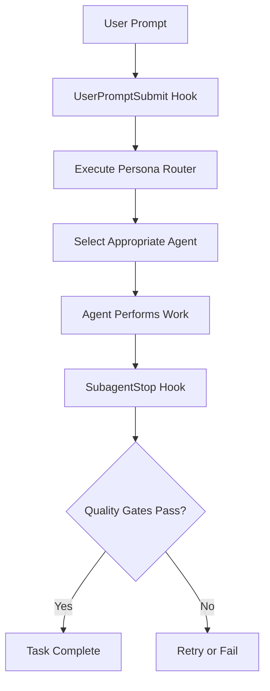

# 🪝 SPARK Hook System Guide

## 📋 Overview

The SPARK v3.5 Hook System leverages official Anthropic Claude Code Hook events to implement automated workflows.

## ✅ Official Anthropic Hook Events (Only 8 Exist)

| Hook Event | Purpose | SPARK Usage |
|------------|---------|-------------|
| **UserPromptSubmit** | When user submits prompt | Execute Persona Router |
| **SubagentStop** | When subagent completes work | Validate Quality Gates |
| **PreToolUse** | Before tool usage | Security validation (optional) |
| **PostToolUse** | After tool usage | Logging/monitoring (optional) |
| **Stop** | Just before Claude response completes | Final validation (optional) |
| **PreCompact** | Before conversation compaction | State saving (optional) |
| **SessionStart** | When session starts/resumes | Context loading (optional) |
| **Notification** | When sending notifications | Notification handling (optional) |

## ⚠️ Non-Existent Hook Events (Never Use)

```python
# ❌ These events do NOT exist!
"subagentStart"      # ❌ Does not exist
"toolUse"           # ❌ Only PreToolUse/PostToolUse exist
"userPromptComplete" # ❌ Does not exist
"assistantResponse"  # ❌ Does not exist
"agentStop"         # ❌ SubagentStop is the correct name
```

## 📁 Hook Configuration File Structure

### .claude/settings.json
```json
{
  "hooks": {
    "UserPromptSubmit": [
      {
        "description": "SPARK Persona Router",
        "hooks": [
          {
            "type": "command",
            "command": "$CLAUDE_PROJECT_DIR/.claude/hooks/spark_persona_router.py",
            "timeout": 60
          }
        ]
      }
    ],
    "SubagentStop": [
      {
        "description": "Jason's 8-Step Quality Gates",
        "hooks": [
          {
            "type": "command",
            "command": "$CLAUDE_PROJECT_DIR/.claude/hooks/spark_quality_gates.py",
            "timeout": 60
          }
        ]
      }
    ]
  }
}
```

## 📊 Hook Exit Code Meanings

| Exit Code | Action | Description |
|-----------|--------|-------------|
| **0** | Success | Continue normally, add stdout to context |
| **2** | Block | Block operation, pass stderr to Claude |
| **Other** | Error | Continue operation, show stderr to user only |

## 📥 Hook Input JSON Structure

### UserPromptSubmit
```json
{
  "session_id": "abc123",
  "transcript_path": "/path/to/conversation.jsonl",
  "cwd": "/project/path",
  "hook_event_name": "UserPromptSubmit",
  "prompt": "User's input prompt"
}
```

### SubagentStop
```json
{
  "session_id": "abc123",
  "transcript_path": "/path/to/conversation.jsonl",
  "hook_event_name": "SubagentStop",
  "stop_hook_active": false
}
```

## 📤 Hook Output JSON Structure

### UserPromptSubmit Output
```json
{
  "continue": true,
  "hookSpecificOutput": {
    "hookEventName": "UserPromptSubmit",
    "additionalContext": "Additional context information to add"
  }
}
```

### SubagentStop Output
```json
{
  "decision": "block",  // or undefined to continue
  "reason": "Quality gates failed: syntax_validation, type_checking"
}
```

## 🔧 SPARK Hook Implementation Patterns

### 1. spark_persona_router.py (UserPromptSubmit)
```python
#!/usr/bin/env python3
import json
import sys

def main():
    try:
        # Read input from stdin
        input_data = json.load(sys.stdin)
        prompt = input_data.get("prompt", "")
        
        # Analyze prompt and activate personas
        personas = analyze_prompt(prompt)
        
        # Add context
        output = {
            "continue": True,
            "hookSpecificOutput": {
                "hookEventName": "UserPromptSubmit",
                "additionalContext": f"Activated personas: {personas}"
            }
        }
        
        print(json.dumps(output))
        sys.exit(0)
        
    except Exception as e:
        print(f"Error: {e}", file=sys.stderr)
        sys.exit(1)

if __name__ == "__main__":
    main()
```

### 2. spark_quality_gates.py (SubagentStop)
```python
#!/usr/bin/env python3
import json
import sys

def main():
    try:
        input_data = json.load(sys.stdin)
        
        # Perform quality validation
        validation_results = run_quality_gates()
        
        if not all(validation_results.values()):
            # Block on quality gate failure
            failed_gates = [k for k, v in validation_results.items() if not v]
            output = {
                "decision": "block",
                "reason": f"Quality gates failed: {', '.join(failed_gates)}"
            }
            print(json.dumps(output))
            sys.exit(2)  # Exit code 2 to block
        
        # Success
        print(json.dumps({"continue": True}))
        sys.exit(0)
        
    except Exception as e:
        print(f"Error: {e}", file=sys.stderr)
        sys.exit(1)

if __name__ == "__main__":
    main()
```

## 🔒 Security Considerations

### Required Validation
```python
def validate_command(command: str) -> bool:
    """Block dangerous commands"""
    dangerous_patterns = [
        'rm -rf /', 'dd if=', ':(){ :|:& };:',
        '> /dev/sda', 'mkfs.', 'format ',
        '; rm ', '&& rm ', '| rm ',
        'eval(', 'exec(', '__import__'
    ]
    
    command_lower = command.lower()
    return not any(pattern in command_lower for pattern in dangerous_patterns)
```

### Path Validation
```python
def validate_path(path: str) -> bool:
    """Prevent path traversal attacks"""
    return not ('..' in path or path.startswith('/'))
```

## 📝 State Management

### State File Locations
```
.claude/workflows/
├── unified_context.json      # Unified context
├── current_task.json         # Current task state
└── team1_current_task.json   # Team-specific task state
```

### State Structure
```json
{
  "task_id": "abc123",
  "prompt": "Original request",
  "personas": ["Backend Developer", "Security Expert"],
  "quality_gates": {
    "syntax_validation": "passed",
    "type_checking": "passed",
    "linting": "failed"
  },
  "retry_count": 1,
  "state": "retrying"
}
```

## 🚀 Hook Activation Workflow



## 🔍 Debugging

### Verify Hook Execution
```bash
# Check hook status
/hooks

# Run in debug mode
claude --debug

# Check hook logs
tail -f ~/.claude/logs/hooks.log
```

### Common Troubleshooting

| Issue | Cause | Solution |
|-------|-------|----------|
| Hook not executing | settings.json configuration error | Check file path and permissions |
| Exit code 2 not working | JSON output format error | Verify decision field |
| Context not being added | Exit code is not 0 | Confirm sys.exit(0) |

## 📚 References

- [Anthropic Hook Guide](https://docs.anthropic.com/en/docs/claude-code/hooks-guide)
- [Hook Reference](https://docs.anthropic.com/en/docs/claude-code/hooks-reference)
- [CLAUDE_CODE_GUIDELINES.md](./CLAUDE_CODE_GUIDELINES.md)

---

*This guide is the official documentation for implementing the SPARK v3.5 Hook System.*