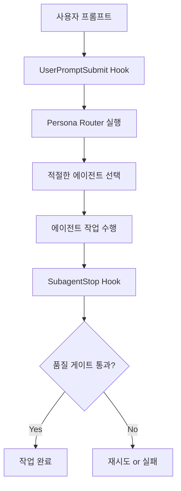

# 🪝 SPARK Hook System Guide

## 📋 Overview

SPARK v3.5 Hook System은 Anthropic Claude Code의 공식 Hook 이벤트를 활용하여 자동화된 워크플로우를 구현합니다.

## ✅ Anthropic 공식 Hook 이벤트 (8개만 존재)

| Hook Event | 용도 | SPARK 활용 |
|------------|------|------------|
| **UserPromptSubmit** | 사용자 프롬프트 제출 시 | Persona Router 실행 |
| **SubagentStop** | 서브에이전트 작업 완료 시 | Quality Gates 검증 |
| **PreToolUse** | 도구 사용 전 | 보안 검증 (선택적) |
| **PostToolUse** | 도구 사용 후 | 로깅/모니터링 (선택적) |
| **Stop** | Claude 응답 완료 직전 | 최종 검증 (선택적) |
| **PreCompact** | 대화 압축 전 | 상태 저장 (선택적) |
| **SessionStart** | 세션 시작/재개 시 | 컨텍스트 로드 (선택적) |
| **Notification** | 알림 전송 시 | 알림 처리 (선택적) |

## ⚠️ 존재하지 않는 Hook 이벤트 (절대 사용 금지)

```python
# ❌ 이런 이벤트들은 존재하지 않습니다!
"subagentStart"      # ❌ 없음
"toolUse"           # ❌ PreToolUse/PostToolUse만 존재
"userPromptComplete" # ❌ 없음
"assistantResponse"  # ❌ 없음
"agentStop"         # ❌ SubagentStop이 올바른 이름
```

## 📁 Hook 설정 파일 구조

### .claude/settings.json
```json
{
  "hooks": {
    "UserPromptSubmit": [
      {
        "description": "SPARK Persona Router",
        "hooks": [
          {
            "type": "command",
            "command": "$CLAUDE_PROJECT_DIR/.claude/hooks/spark_persona_router.py"
          }
        ]
      }
    ],
    "SubagentStop": [
      {
        "description": "Jason's 8-Step Quality Gates",
        "hooks": [
          {
            "type": "command",
            "command": "$CLAUDE_PROJECT_DIR/.claude/hooks/spark_quality_gates.py"
          }
        ]
      }
    ]
  }
}
```

## 📊 Hook Exit Code 의미

| Exit Code | 동작 | 설명 |
|-----------|------|------|
| **0** | 성공 | 정상 진행, stdout을 컨텍스트에 추가 |
| **2** | 차단 | 작업 차단, stderr를 Claude에게 전달 |
| **기타** | 에러 | 작업은 계속, stderr를 사용자에게만 표시 |

## 📥 Hook 입력 JSON 구조

### UserPromptSubmit
```json
{
  "session_id": "abc123",
  "transcript_path": "/path/to/conversation.jsonl",
  "cwd": "/project/path",
  "hook_event_name": "UserPromptSubmit",
  "prompt": "사용자가 입력한 프롬프트"
}
```

### SubagentStop
```json
{
  "session_id": "abc123",
  "transcript_path": "/path/to/conversation.jsonl",
  "hook_event_name": "SubagentStop",
  "stop_hook_active": false
}
```

## 📤 Hook 출력 JSON 구조

### UserPromptSubmit 출력
```json
{
  "continue": true,
  "hookSpecificOutput": {
    "hookEventName": "UserPromptSubmit",
    "additionalContext": "추가할 컨텍스트 정보"
  }
}
```

### SubagentStop 출력
```json
{
  "decision": "block",  // or undefined to continue
  "reason": "Quality gates failed: syntax_validation, type_checking"
}
```

## 🔧 SPARK Hook 구현 패턴

### 1. spark_persona_router.py (UserPromptSubmit)
```python
#!/usr/bin/env python3
import json
import sys

def main():
    try:
        # stdin에서 입력 읽기
        input_data = json.load(sys.stdin)
        prompt = input_data.get("prompt", "")
        
        # 프롬프트 분석 및 페르소나 활성화
        personas = analyze_prompt(prompt)
        
        # 컨텍스트 추가
        output = {
            "continue": True,
            "hookSpecificOutput": {
                "hookEventName": "UserPromptSubmit",
                "additionalContext": f"Activated personas: {personas}"
            }
        }
        
        print(json.dumps(output))
        sys.exit(0)
        
    except Exception as e:
        print(f"Error: {e}", file=sys.stderr)
        sys.exit(1)

if __name__ == "__main__":
    main()
```

### 2. spark_quality_gates.py (SubagentStop)
```python
#!/usr/bin/env python3
import json
import sys

def main():
    try:
        input_data = json.load(sys.stdin)
        
        # 품질 검증 수행
        validation_results = run_quality_gates()
        
        if not all(validation_results.values()):
            # 품질 게이트 실패 시 차단
            failed_gates = [k for k, v in validation_results.items() if not v]
            output = {
                "decision": "block",
                "reason": f"Quality gates failed: {', '.join(failed_gates)}"
            }
            print(json.dumps(output))
            sys.exit(2)  # Exit code 2로 차단
        
        # 성공
        print(json.dumps({"continue": True}))
        sys.exit(0)
        
    except Exception as e:
        print(f"Error: {e}", file=sys.stderr)
        sys.exit(1)

if __name__ == "__main__":
    main()
```

## 🔒 보안 고려사항

### 필수 검증
```python
def validate_command(command: str) -> bool:
    """위험한 명령어 차단"""
    dangerous_patterns = [
        'rm -rf /', 'dd if=', ':(){ :|:& };:',
        '> /dev/sda', 'mkfs.', 'format ',
        '; rm ', '&& rm ', '| rm ',
        'eval(', 'exec(', '__import__'
    ]
    
    command_lower = command.lower()
    return not any(pattern in command_lower for pattern in dangerous_patterns)
```

### 경로 검증
```python
def validate_path(path: str) -> bool:
    """경로 탐색 공격 방지"""
    return not ('..' in path or path.startswith('/'))
```

## 📝 상태 관리

### 상태 파일 위치
```
.claude/workflows/
├── unified_context.json      # 통합 컨텍스트
├── current_task.json         # 현재 작업 상태
└── team1_current_task.json   # 팀별 작업 상태
```

### 상태 구조
```json
{
  "task_id": "abc123",
  "prompt": "원본 요청",
  "personas": ["Backend Developer", "Security Expert"],
  "quality_gates": {
    "syntax_validation": "passed",
    "type_checking": "passed",
    "linting": "failed"
  },
  "retry_count": 1,
  "state": "retrying"
}
```

## 🚀 Hook 활성화 워크플로우



## 🔍 디버깅

### Hook 실행 확인
```bash
# Hook 상태 확인
/hooks

# 디버그 모드로 실행
claude --debug

# Hook 로그 확인
tail -f ~/.claude/logs/hooks.log
```

### 일반적인 문제 해결

| 문제 | 원인 | 해결 |
|------|------|------|
| Hook이 실행되지 않음 | settings.json 설정 오류 | 파일 경로 및 권한 확인 |
| Exit code 2가 작동하지 않음 | JSON 출력 형식 오류 | decision 필드 확인 |
| 컨텍스트가 추가되지 않음 | Exit code가 0이 아님 | sys.exit(0) 확인 |

## 📚 참고 자료

- [Anthropic Hook Guide](https://docs.anthropic.com/en/docs/claude-code/hooks-guide)
- [Hook Reference](https://docs.anthropic.com/en/docs/claude-code/hooks-reference)
- [CLAUDE_CODE_GUIDELINES.md](./CLAUDE_CODE_GUIDELINES.md)

---

*이 가이드는 SPARK v3.5의 Hook 시스템 구현을 위한 공식 문서입니다.*