# 🏗️ SPARK v3.5 Integrated Architecture

> **Complete blueprint for seamless orchestration of all SPARK components**
> 
> *Based on Ultra Deep Thinking Analysis - 12 Phase Systematic Design*

---

## 🎯 Core Architecture Principles

### 1. **Single Responsibility**
Each component has ONE clear role. No overlaps, no confusion.

### 2. **Loose Coupling**
Components communicate through well-defined interfaces (JSON files).

### 3. **Information Hierarchy**
```
User Intent (Highest Priority)
    ↓
2호 Interpretation
    ↓
Hook Enhancement
    ↓
JSON State
    ↓
Agent Standards (Default)
```

### 4. **Decision Authority**
Only 2호 (Number Two) has decision-making power. All other components follow instructions.

---

## 📊 Component Responsibility Matrix

| Component | Primary Role | What It Controls | What It Cannot Do |
|-----------|-------------|------------------|-------------------|
| **2호 (Orchestrator)** | Decision & Control | Task assignment, Flow control, Agent selection | Direct file modification |
| **Hooks** | Automation | Context enhancement, Quality validation | Agent selection, Task creation |
| **JSON Files** | State Management | Information relay, Progress tracking | Decision making |
| **Agents** | Execution | Actual work, Result generation | Calling other agents |
| **Commands** | Workflow Definition | Execution sequence, Quality standards | Dynamic adaptation |

---

## 🔄 Information Flow Architecture

### **Layer 1: Input Processing**

```mermaid
graph LR
    U[User] -->|Request| O[2호]
    O -->|Analyze| C{Command?}
    C -->|Yes| CMD[Command Definition]
    C -->|No| D[Direct Processing]
    CMD -->|Workflow| O
    D -->|Simple Task| E[Execute]
```


### **Layer 2: Context Enhancement**

```mermaid
graph TD
    O[2호] -->|Prompt| H[UserPromptSubmit Hook]
    H -->|Calculate| CX[Complexity Score]
    H -->|Identify| P[Personas]
    H -->|Create| J[current_task.json]
    H -->|Enhance| EP[Enhanced Prompt]
    EP -->|Return to| O
```


### **Layer 3: Execution Control**


---

## 📋 Scenario-Based Workflows

### **Scenario 1: Simple Task (Complexity < 0.3)**
```yaml
Example: "Fix typo in README"
Flow:
  1. User → 2호
  2. 2호 directly executes (no agent needed)
  3. Complete
Components Used: Only 2호
Time: < 1 minute
```

### **Scenario 2: Standard Command (Complexity 0.3-0.7)**
```yaml
Example: "/implement JWT authentication"
Flow:
  1. User → "/implement" command
  2. 2호 reads command workflow
  3. UserPromptSubmit Hook:
     - Complexity: 0.5
     - Personas: Backend, Security
     - Creates: current_task.json
  4. 2호 → implementer-spark
     - Reads: current_task.json
     - Writes: implementation_result.json
  5. SubagentStop Hook validates quality
  6. 2호 → tester-spark
     - Reads: implementation_result.json
     - Writes: test_result.json
  7. 2호 → documenter-spark
     - Writes: documentation
  8. Complete
Components Used: All (orchestrated)
Time: 15-30 minutes
```

### **Scenario 3: Parallel Execution (Complexity ≥ 0.7)**
```yaml
Example: "Build complete microservices architecture"
Flow:
  1. User → complex request
  2. UserPromptSubmit Hook:
     - Complexity: 0.9
     - Wave mode activated
     - Creates: team_coordination.json
  3. 2호 → spawner-spark (orchestrator)
     - Creates: team1-4_task.json
  4. 2호 parallel calls (SIMULTANEOUS):
     - Task(team1-implementer-spark, "auth service")
     - Task(team2-implementer-spark, "payment service")
     - Task(team3-implementer-spark, "notification service")
     - Task(team4-implementer-spark, "gateway service")
  5. Each team (WORKING IN PARALLEL):
     - Reads: team[N]_task.json
     - Works independently
     - CANNOT call other agents
     - Writes: team[N]_result.json
  6. SYNCHRONIZATION POINT:
     - ALL teams must complete
     - Even if team1 finishes in 10min, waits for slowest team
     - 2호 waits for ALL team[N]_result.json files
  7. 2호 collects all results (ONLY after all complete)
  8. 2호 → tester-spark (integration testing)
  9. Complete
Components Used: All (parallel + orchestrated)
Time: 30-60 minutes (determined by slowest team)
Critical: No agent can proceed to next phase until ALL parallel agents finish
```

---

## 📁 JSON File Lifecycle

### **File Categories**

#### **Persistent Files** (Cross-session)
```json
{
  "project_context.json": "Project metadata and configuration",
  "quality_standards.json": "Project-specific quality requirements"
}
```

#### **Session Files** (Created/Destroyed per task)
```json
{
  "current_task.json": "Active task metadata (Hook → Agent)",
  "analysis_result.json": "Analysis output (Analyzer → Next)",
  "implementation_result.json": "Code created (Implementer → Tester)",
  "test_result.json": "Test coverage (Tester → Documenter)"
}
```

#### **Parallel Work Files**
```json
{
  "team_coordination.json": "Overall parallel plan (Spawner → Teams)",
  "team1-4_task.json": "Team assignments (Spawner → Each team)",
  "team1-4_result.json": "Team outputs (Teams → 2호)"
}
```

### **State Transitions**
```
CREATE: Hook/Agent writes file
READ: Next agent consumes file
UPDATE: Hook updates status
DELETE: 2호 cleans up after completion
```

---

## 🪝 Hook System Boundaries

### **UserPromptSubmit Hook**
✅ **CAN DO:**
- Calculate complexity scores
- Identify required personas
- Create/update current_task.json
- Enhance prompt with context

❌ **CANNOT DO:**
- Select specific agents
- Call Task tool
- Modify workflow sequence
- Make decisions

### **SubagentStop Hook**
✅ **CAN DO:**
- Validate quality gates
- Block poor quality (exit 2)
- Request retry with guidance
- Verify result JSON

❌ **CANNOT DO:**
- Choose next agent
- Create new tasks
- Modify workflow
- Override 2호 decisions

---

## 🎮 2호 Orchestration Powers

### **⚠️ CRITICAL ARCHITECTURAL CONSTRAINT**
**Only 2호 (Number Two) can call agents using the Task tool.**
- Agents CANNOT call other agents
- Agents CANNOT use the Task tool
- Agents must complete their work independently
- All orchestration decisions belong to 2호 alone

### **🔄 Parallel Execution Constraint**
**In parallel execution, ALL agents must complete before proceeding:**
```
Team1 ─┐
Team2 ─┼─ ALL must finish → Next phase
Team3 ─┘
```
- If Team1 finishes in 5 minutes but Team2 needs 20 minutes, Team1's results wait
- 2호 collects results ONLY after all parallel agents complete
- No partial processing or early continuation
- This ensures consistency and prevents race conditions

### **Exclusive Capabilities**
1. **Task Tool Usage** - ONLY 2호 can call agents (절대 원칙)
2. **Flow Control** - Sequential vs Parallel decisions
3. **Result Integration** - Combining multi-agent outputs
4. **User Communication** - Interpreting and responding
5. **Dynamic Adaptation** - Handling exceptions

### **Decision Points**
```python
def orchestrate(request):
    # 1. Agent needed?
    if complexity < 0.3:
        return self.handle_directly()
    
    # 2. Which agent?
    agent = select_agent(request_type)
    
    # 3. Sequential or Parallel?
    if complexity >= 0.7:
        return parallel_execution(agents)
    else:
        return sequential_execution(agents)
    
    # 4. Retry on failure?
    if quality_failed and retries < 3:
        return retry_with_guidance()
    
    # 5. How to integrate?
    return combine_results(all_outputs)
```

---

## 📐 Information Priority System

### **Priority Levels** (Highest → Lowest)
1. **User Direct Instruction** - "Do X specifically this way"
2. **2호 Interpretation** - Task prompts with context
3. **Hook Automation** - Calculated enhancements
4. **JSON State** - Stored context and results
5. **Agent Defaults** - Standard procedures

### **Conflict Resolution**
```yaml
Example:
  Agent_Default: "95% test coverage required"
  User_Says: "80% is enough for this sprint"
  Resolution: User instruction wins (80%)

Principle: Specific > General, Dynamic > Static
```

---

## 🚀 Implementation Patterns

### **Pattern 1: Sequential Relay**
```
Analyzer → Implementer → Tester → Documenter
Each reads previous agent's JSON output
```

### **Pattern 2: Parallel Burst**
```
        ┌→ Team1 ─┐
2호 ─────┼→ Team2 ─┼───→ Integration
        └→ Team3 ─┘
Teams work independently, merge results
```

### **Pattern 3: Wave Execution**
```
Wave 1: Discovery (Analyzer, Loader)
Wave 2: Implementation (Teams 1-4)
Wave 3: Integration (Tester)
Wave 4: Quality (Improver)
Wave 5: Deployment (Builder)
```

---

## 📊 Complexity-Based Routing

| Complexity | Execution Mode | Components Used | Typical Time |
|------------|---------------|-----------------|--------------|
| **0.0-0.3** | Direct by 2호 | None | < 1 min |
| **0.3-0.5** | Single Agent | Agent + Hooks | 5-10 min |
| **0.5-0.7** | Sequential | Multiple Agents | 15-30 min |
| **0.7-0.9** | Parallel | Teams + Spawner | 30-60 min |
| **0.9-1.0** | Wave Mode | All Components | 60+ min |

---

## 🔒 Quality Assurance Points

### **Entry Gates**
- UserPromptSubmit: Pre-validation and context preparation
- Agent MANDATORY INITIALIZATION: Force context reading

### **Process Gates**
- JSON relay: Explicit state tracking
- TodoWrite: Progress visibility

### **Exit Gates**
- SubagentStop: Quality validation
- Agent MANDATORY OUTPUT: Force result writing

---

## 💡 Best Practices

### **DO's ✅**
1. Let 2호 orchestrate - don't fight the system
2. Use JSON for state - explicit is better than implicit
3. Trust the hooks - they prevent errors
4. Follow the workflow - commands define proven paths
5. Check quality gates - they ensure standards
6. Complete work independently - agents work in isolation
7. Wait for all parallel agents - synchronization is mandatory

### **DON'Ts ❌**
1. Bypass 2호 - it breaks orchestration
2. Skip JSON files - loses state tracking
3. Ignore hooks - misses automation benefits
4. Modify workflows dynamically - causes confusion
5. Mix responsibilities - violates architecture
6. Try to call other agents - ONLY 2호 can use Task tool
7. Proceed before all parallel agents finish - breaks consistency

### **What Agents CANNOT DO ⛔**
```yaml
Forbidden Actions:
  - Call other agents: "Task('another-agent', ...)"  # ❌ NEVER
  - Use Task tool: Only 2호 has this permission      # ❌ NEVER
  - Skip synchronization: Wait for parallel peers    # ❌ NEVER
  - Direct communication: Use JSON files instead     # ❌ NEVER
  - Make orchestration decisions: 2호's job only     # ❌ NEVER
  
Agent Limitations:
  - Cannot see other agents' work in progress
  - Cannot trigger next phase transitions
  - Cannot modify team coordination files
  - Cannot override quality gates
  - Cannot change workflow sequence
```

---

## 🎯 Real-World Example: Chat System

**Request**: "Implement real-time chat with WebSocket"

**Execution Flow**:
```
1. User → "/implement real-time chat with WebSocket"
2. 2호 reads /implement command definition
3. UserPromptSubmit Hook:
   - Complexity: 0.8 (real-time + WebSocket)
   - Activates: Backend, Frontend, Security personas
   - Creates: current_task.json with requirements
4. 2호 → spawner-spark: "Orchestrate 4-team implementation"
5. Spawner creates team assignments:
   - Team1: WebSocket server implementation
   - Team2: Chat UI components
   - Team3: Message persistence layer
   - Team4: Authentication & security
6. 2호 parallel execution:
   Task × 4 (all teams simultaneously)
7. Each team:
   - Reads own team[N]_task.json
   - Implements assigned module
   - Writes team[N]_result.json
8. SubagentStop × 4: Each team's quality validated
9. 2호 collects all team results
10. 2호 → tester-spark: "Integration testing"
11. 2호 → documenter-spark: "Complete documentation"
12. Final report to user
```

**Time**: ~45 minutes
**Quality**: All gates passed
**Coverage**: 95%+ achieved

---

## 📈 Performance Metrics

| Metric | Traditional | SPARK v3.5 | Improvement |
|--------|------------|------------|-------------|
| **Token Usage** | 44,000 | 5,100 | -88.4% |
| **Execution Time** | Sequential only | Parallel capable | -60% on complex |
| **Quality Consistency** | Variable | Enforced gates | 100% compliance |
| **State Tracking** | Implicit | Explicit JSON | Full visibility |
| **Error Recovery** | Manual | Automated retry | 3x retry logic |

---

## 🔮 Future Enhancements

### **Planned Features**
1. **Intelligent Caching** - Reuse previous analyses
2. **Adaptive Complexity** - Learn from patterns
3. **Custom Workflows** - User-defined sequences
4. **Distributed Execution** - Multi-machine support
5. **Real-time Monitoring** - Live progress dashboard

### **Research Areas**
1. **AI-driven Orchestration** - 2호 learns optimal paths
2. **Predictive Quality** - Anticipate issues before they occur
3. **Auto-scaling** - Dynamic team allocation
4. **Cross-project Learning** - Share patterns across projects

---

## 📚 Conclusion

SPARK v3.5's integrated architecture achieves:

1. **Clear Separation of Concerns** - Each component has one job
2. **Efficient Information Flow** - JSON-based state management
3. **Scalable Execution** - From simple to enterprise-scale
4. **Guaranteed Quality** - Enforced gates at every step
5. **Full Visibility** - Explicit tracking throughout

The system transforms chaos into order through:
- **2호's intelligent orchestration**
- **Hook's automated enhancements**
- **JSON's explicit state tracking**
- **Agent's specialized execution**
- **Command's proven workflows**

Together, they create a symphony of coordinated automation that delivers consistent, high-quality results at 88.4% reduced token cost.

---

*"Simplicity is the ultimate sophistication" - Applied to multi-agent orchestration*