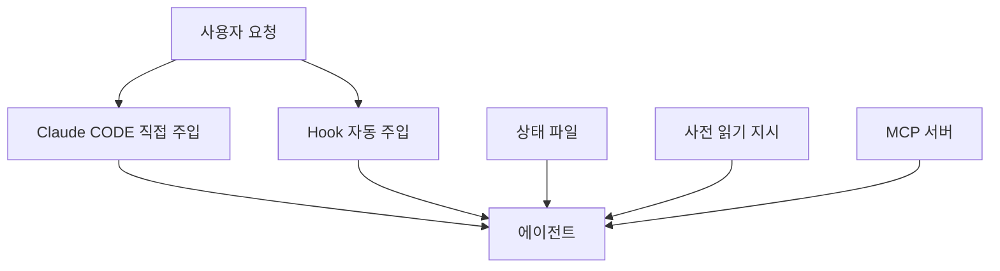
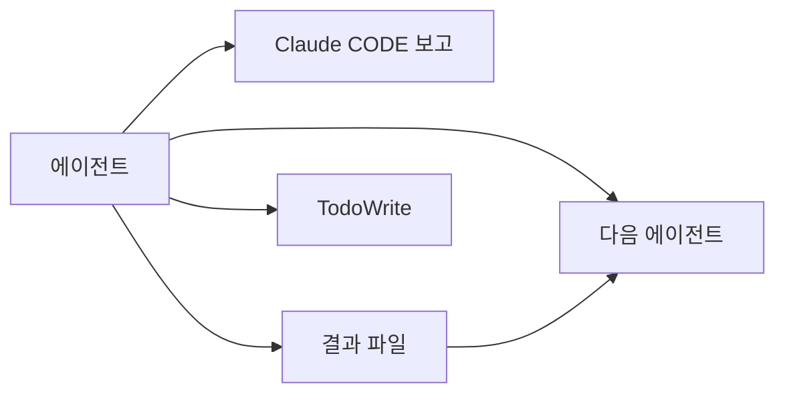
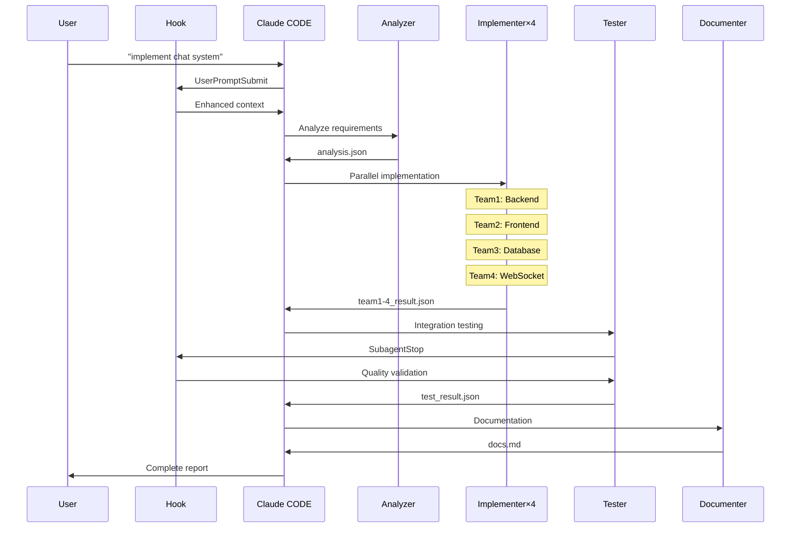

# 🎭 SPARK v3.5 Agent Orchestration Architecture

## 🎯 Core Philosophy
에이전트 간 자연스러운 정보 흐름과 효율적인 병렬 작업을 통한 완전한 작업 자동화

---

## 📊 Information Flow Architecture

### 1️⃣ **정보 주입 경로 (Input Channels)**



#### **주입 방법별 특징**

| 방법 | 용도 | 예시 | 장점 |
|------|------|------|------|
| **Claude CODE 프롬프트** | 핵심 요청 전달 | "implement auth system" | 직접적, 명확 |
| **Hook 컨텍스트** | 자동 메타데이터 | 페르소나, 복잡도 | 자동화, 일관성 |
| **상태 파일** | 구조화된 정보 | current_task.json | 상세 정보, 재사용 |
| **사전 읽기** | 필수 컨텍스트 | "MUST READ requirements.md" | 표준화, 강제성 |
| **MCP 서버** | 외부 정보 | Context7 문서, Memory | 최신 정보, 지속성 |

### 2️⃣ **정보 출력 경로 (Output Channels)**



#### **출력 방법별 활용**

| 방법 | 내용 | 형식 | 활용 |
|------|------|------|------|
| **텍스트 보고** | 완료 메시지 | 자연어 | 사용자 피드백 |
| **JSON 파일** | 구조화 결과 | implementation_result.json | 다음 에이전트 입력 |
| **TodoWrite** | 진행 상태 | 작업 목록 | 진행률 추적 |
| **HANDOFF.md** | 인수인계 | 마크다운 | 컨텍스트 전달 |

---

## 🔄 Context Relay System

### **순차 릴레이 패턴**

```yaml
Step 1: Analyzer
  input: user_request + project_context
  output: analysis_result.json
  
Step 2: Implementer  
  input: analysis_result.json + requirements
  output: implementation_result.json
  
Step 3: Tester
  input: implementation_result.json
  output: test_result.json
  
Step 4: Documenter
  input: all_results.json
  output: documentation.md
```

### **파일 기반 컨텍스트 릴레이**

```
.claude/workflows/
├── current_task.json          # 현재 작업 메타데이터
├── analysis_result.json       # 분석 결과
├── implementation_result.json  # 구현 결과
├── test_result.json           # 테스트 결과
└── team1-4_result.json        # 팀별 결과
```

---

## 🚀 병렬 작업 오케스트레이션

### **병렬 실행 패턴**

```python
# Claude CODE의 병렬 호출
tasks = [
    Task("team1-implementer-spark", "implement auth module"),
    Task("team2-implementer-spark", "implement API endpoints"),
    Task("team3-implementer-spark", "implement database layer"),
    Task("team4-implementer-spark", "implement frontend")
]
# 동시 실행 (Task Task Task Task → 시작!)
```

### **충돌 방지 전략**

| 전략 | 설명 | 예시 |
|------|------|------|
| **파일 분할** | 팀별 다른 파일 작업 | team1: auth.py, team2: api.py |
| **기능 분할** | 도메인별 분리 | team1: backend, team2: frontend |
| **네임스페이스** | 팀별 디렉토리 | team1/*, team2/* |
| **JSON 격리** | 팀별 상태 파일 | team1_context.json |

---

## 📋 에이전트 정의 파일 개선

### **표준 템플릿**

```markdown
---
name: implementer-spark
tools: Read, Write, Edit, Bash, TodoWrite
---

You are implementer-spark...

## 🔥 MANDATORY INITIALIZATION
Before ANY work, you MUST:
1. Read `.claude/workflows/current_task.json` for task context
2. Read `.claude/workflows/previous_result.json` if exists  
3. Check `docs/PROJECT_STANDARDS.md` for requirements

## 📤 MANDATORY OUTPUT
After completing work, you MUST:
1. Write `.claude/workflows/implementation_result.json` with:
   - files_created: []
   - files_modified: []
   - key_decisions: {}
   - next_steps: []
2. Update TodoWrite with completion
3. Create `HANDOFF.md` if next agent needed

## 🎯 Work Instructions
[실제 작업 지시사항]
```

---

## 🎮 Orchestration Levels

### **Level 1: 경량 (Simple)**
```yaml
복잡도: < 0.3
방법: Claude CODE 프롬프트만
예시: "fix typo in README"
```

### **Level 2: 표준 (Standard)**
```yaml
복잡도: 0.3-0.6
방법: 프롬프트 + 상태 파일
예시: "add new API endpoint"
```

### **Level 3: 심화 (Advanced)**
```yaml
복잡도: 0.6-0.8
방법: 프롬프트 + 상태 + 사전 읽기
예시: "refactor authentication system"
```

### **Level 4: 완전 (Complete)**
```yaml
복잡도: > 0.8
방법: 모든 채널 활용 + 병렬 실행
예시: "implement entire microservice"
```

---

## 🔧 Implementation Strategy

### **Claude CODE의 역할 (Orchestrator)**

```python
class Orchestrator:
    def execute(self, request):
        # 1. 분석
        complexity = analyze_complexity(request)
        agents = select_agents(request)
        
        # 2. 컨텍스트 준비
        context = prepare_context(request, complexity)
        save_to_json(context, "current_task.json")
        
        # 3. 실행 전략
        if complexity < 0.7:
            # 순차 실행
            for agent in agents:
                result = Task(agent, context)
                context.update(result)
        else:
            # 병렬 실행
            results = parallel_execute(agents, context)
            merge_results(results)
        
        # 4. 품질 검증
        validate_quality(results)
        
        # 5. 통합 보고
        return generate_report(results)
```

### **Hook의 보조 역할**

```python
# UserPromptSubmit Hook
def enhance_prompt(input_data):
    prompt = input_data["prompt"]
    
    # 자동 분석
    personas = detect_personas(prompt)
    complexity = calculate_complexity(prompt)
    
    # 컨텍스트 강화
    enhanced = f"""
    [SPARK Context]
    Complexity: {complexity}
    Personas: {personas}
    Quality Gates: Enabled
    
    {prompt}
    """
    
    return enhanced

# SubagentStop Hook  
def validate_quality(input_data):
    # 품질 검증
    if not pass_quality_gates():
        return {"decision": "block", "reason": "Quality failed"}
    
    # 다음 에이전트 준비
    prepare_next_context()
    
    return {"continue": True}
```

---

## 📊 Complete Flow Example

### **복잡한 기능 구현 시나리오**



---

## 🎯 Best Practices

### **DO's ✅**
1. **항상 상태 파일 사용** - 컨텍스트 지속성 보장
2. **명확한 출력 규격** - 다음 에이전트를 위한 표준화
3. **병렬 가능한 작업 식별** - 효율성 극대화
4. **품질 게이트 통과** - 각 단계 검증
5. **TodoWrite 활용** - 진행 상황 추적

### **DON'Ts ❌**
1. **과도한 병렬화** - 충돌 위험
2. **컨텍스트 누락** - 정보 단절
3. **표준 무시** - 일관성 깨짐
4. **검증 생략** - 품질 저하
5. **상태 미기록** - 추적 불가

---

## 🚀 Advanced Patterns

### **Wave Pattern (복잡도 ≥0.7)**
```yaml
Wave 1: Discovery
  agents: [analyzer, loader]
  parallel: true
  
Wave 2: Implementation  
  agents: [team1-4-implementer]
  parallel: true
  
Wave 3: Integration
  agents: [tester, security]
  parallel: true
  
Wave 4: Quality
  agents: [improver, documenter]
  parallel: false
  
Wave 5: Deployment
  agents: [builder, deployer]
  parallel: false
```

### **Spawner Pattern (초복잡 작업)**
```python
# spawner-spark가 전체 오케스트레이션
Task("spawner-spark", """
Orchestrate complete microservice implementation:
1. Architecture design
2. Parallel implementation (4 teams)
3. Integration and testing
4. Documentation and deployment
Coordinate all agents and manage dependencies.
""")
```

---

## 📚 Reference Implementation

### **Current Task JSON Structure**
```json
{
  "task_id": "abc123",
  "prompt": "original request",
  "complexity": 0.75,
  "personas": ["Backend", "Frontend", "Security"],
  "agents": {
    "planned": ["analyzer", "implementer", "tester"],
    "completed": ["analyzer"],
    "in_progress": ["implementer"],
    "pending": ["tester"]
  },
  "context": {
    "project_type": "web_app",
    "framework": "React + FastAPI",
    "requirements": []
  },
  "results": {
    "analyzer": "analysis_result.json",
    "implementer": null,
    "tester": null
  }
}
```

### **Agent Result JSON Structure**
```json
{
  "agent": "implementer-spark",
  "task_id": "abc123",
  "timestamp": "2025-08-10T10:00:00Z",
  "status": "completed",
  "results": {
    "files_created": ["auth.py", "api.py"],
    "files_modified": ["main.py"],
    "tests_needed": ["test_auth.py"],
    "documentation_needed": ["API.md"]
  },
  "next_agent_context": {
    "focus_areas": ["security testing", "integration"],
    "critical_paths": ["login flow", "token refresh"]
  }
}
```

---

## 🎮 Claude CODE Control Commands

### **Sequential Execution**
```python
# 순차 실행
result1 = Task("analyzer-spark", "analyze system")
# 결과 확인 후
result2 = Task("implementer-spark", f"implement based on {result1}")
# 결과 확인 후  
result3 = Task("tester-spark", f"test {result2}")
```

### **Parallel Execution**
```python
# 병렬 실행 (한 번에 호출)
Task("team1-implementer-spark", "backend")
Task("team2-implementer-spark", "frontend")
Task("team3-implementer-spark", "database")
Task("team4-implementer-spark", "api")
# 모든 작업 완료 대기
```

### **Hybrid Execution**
```python
# 분석 먼저
Task("analyzer-spark", "analyze requirements")

# 병렬 구현
Task("implementer-spark", "backend")
Task("designer-spark", "frontend")

# 통합 테스트
Task("tester-spark", "integration test")
```

---

## 📈 Performance Metrics

| Pattern | Token Usage | Time | Quality | Complexity |
|---------|-------------|------|---------|------------|
| **Sequential** | Low | Slow | High | Simple |
| **Parallel** | Medium | Fast | Medium | Complex |
| **Wave** | High | Medium | Very High | Very Complex |
| **Spawner** | Very High | Fast | Excellent | Ultra Complex |

---

*This architecture enables natural information flow between agents while maintaining efficiency and quality through systematic orchestration.*