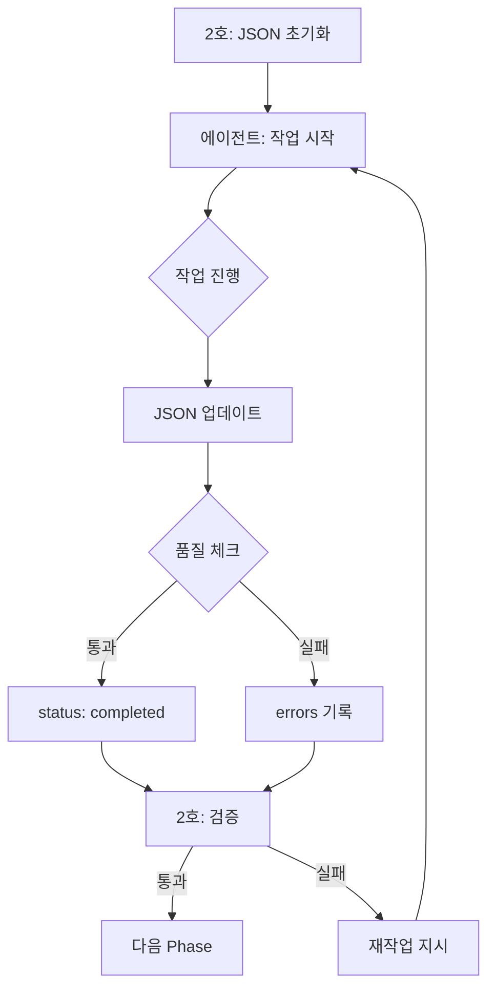

# 📊 JSON State Management Protocol

**작성자**: 2호  
**버전**: 1.0  
**작성일**: 2025-09-08

## 🎯 JSON 파일의 핵심 역할

JSON 파일은 **2호와 에이전트 간의 상태 공유 브리지**입니다.
- 2호: 초기 구조 생성, 최종 검증
- 에이전트: 작업 진행상황 업데이트, 품질 메트릭 기록
- 목적: 비동기 실행 중 상태 추적 및 품질 보증

## 📁 JSON 파일 종류와 위치

```bash
~/.claude/workflows/
├── current_task.json          # 단일 에이전트 작업
├── team1_current_task.json    # Team 1 전용
├── team2_current_task.json    # Team 2 전용
├── team3_current_task.json    # Team 3 전용
├── team4_current_task.json    # Team 4 전용
├── team5_current_task.json    # Team 5 전용
└── file_locks.json            # 파일 충돌 방지용
```

## 📝 JSON 구조 상세 명세

### 1. 초기 구조 (2호가 생성)

```json
{
  "id": "spark_20250908_141500",
  "version": "4.3",
  "task_info": {
    "task_id": "AKL-02",
    "task_name": "load_mcp_keys.sh 개선",
    "checklist_path": "/docs/blueprints/checklists/Checklist_AKL-02.md",
    "assigned_agent": "team1-implementer-spark",
    "created_at": "2025-09-08T14:15:00Z"
  },
  "state": {
    "status": "pending",  // pending -> running -> completed/failed
    "phase": "not_started",
    "started_at": null,
    "completed_at": null
  },
  "implementation": {
    "files_modified": [],
    "files_created": [],
    "lines_added": 0,
    "lines_removed": 0
  },
  "testing": {
    "tests_created": 0,
    "tests_passed": 0,
    "tests_failed": 0,
    "coverage_percent": 0
  },
  "quality": {
    "violations_total": -1,  // -1 = not checked yet
    "shellcheck_violations": -1,
    "ruff_violations": -1,
    "mypy_violations": -1,
    "can_proceed": false
  },
  "errors": [],
  "warnings": []
}
```

### 2. 에이전트 업데이트 패턴

```python
# Phase 0: 작업 시작
json_data['state']['status'] = 'running'
json_data['state']['phase'] = 'phase_1_analysis'
json_data['state']['started_at'] = datetime.now()

# Phase 1-4: 작업 진행
json_data['state']['phase'] = 'phase_2_implementation'
json_data['implementation']['files_modified'].append('bin/core/load_mcp_keys.sh')
json_data['implementation']['lines_added'] = 245
json_data['implementation']['lines_removed'] = 120

# Phase 5A: 품질 측정
json_data['quality']['shellcheck_violations'] = 0
json_data['quality']['ruff_violations'] = 0
json_data['quality']['violations_total'] = 0

# Phase 5B: 최종 판정
json_data['quality']['can_proceed'] = True
json_data['state']['status'] = 'completed'
json_data['state']['completed_at'] = datetime.now()
```

### 3. 2호의 검증 로직

```python
def validate_team_result(team_id: str) -> bool:
    """팀 작업 결과 검증"""
    json_path = f"~/.claude/workflows/team{team_id}_current_task.json"
    data = read_json(json_path)
    
    # 필수 검증 항목
    checks = [
        data['state']['status'] == 'completed',
        data['quality']['violations_total'] == 0,
        data['quality']['can_proceed'] == True,
        data['testing']['coverage_percent'] >= 95,
        len(data['errors']) == 0
    ]
    
    if not all(checks):
        print(f"❌ Team {team_id} 품질 기준 미달:")
        print(f"  - Status: {data['state']['status']}")
        print(f"  - Violations: {data['quality']['violations_total']}")
        print(f"  - Coverage: {data['testing']['coverage_percent']}%")
        print(f"  - Errors: {len(data['errors'])}")
        return False
    
    print(f"✅ Team {team_id} 품질 기준 통과!")
    return True
```

## 🔄 JSON 생명주기 (Lifecycle)

### 1. 생성 (Creation)
```python
# 2호가 작업 시작 전 생성
def create_team_json(team_id: int, task: Task):
    json_path = f"~/.claude/workflows/team{team_id}_current_task.json"
    initial_data = {
        "id": f"spark_{datetime.now().strftime('%Y%m%d_%H%M%S')}",
        "version": "4.3",
        "task_info": {
            "task_id": task.id,
            "task_name": task.name,
            "checklist_path": task.checklist_path,
            "assigned_agent": f"team{team_id}-implementer-spark"
        },
        # ... (나머지 초기 구조)
    }
    write_json(json_path, initial_data)
```

### 2. 업데이트 (Update)
```python
# 에이전트가 작업 중 업데이트
def update_progress(json_path: str, updates: dict):
    data = read_json(json_path)
    
    # 깊은 병합 (deep merge)
    for key, value in updates.items():
        if isinstance(value, dict) and key in data:
            data[key].update(value)
        else:
            data[key] = value
    
    write_json(json_path, data)
```

### 3. 검증 (Validation)
```python
# 2호가 Phase 완료 후 검증
def validate_phase_completion(team_id: int, phase: str) -> bool:
    data = read_json(f"team{team_id}_current_task.json")
    
    if phase == "implementation":
        return data['quality']['violations_total'] == 0
    elif phase == "testing":
        return data['testing']['coverage_percent'] >= 95
    elif phase == "documentation":
        return len(data['documentation']['files_created']) > 0
    
    return False
```

### 4. 정리 (Cleanup)
```python
# 작업 완료 후 아카이빙
def archive_completed_task(team_id: int):
    source = f"team{team_id}_current_task.json"
    timestamp = datetime.now().strftime('%Y%m%d_%H%M%S')
    archive = f"archive/team{team_id}_{timestamp}.json"
    
    shutil.move(source, archive)
    print(f"📦 Archived: {archive}")
```

## 🚨 중요 규칙과 제약사항

### 1. 동시 쓰기 방지
```python
# ❌ WRONG: 여러 에이전트가 동일 JSON 수정
Task("implementer-spark", "작업1")  # current_task.json 수정
Task("tester-spark", "테스트")      # 동일 파일 수정 → 충돌!

# ✅ CORRECT: 팀별 별도 JSON 사용
Task("team1-implementer-spark", "작업1")  # team1_current_task.json
Task("team2-implementer-spark", "작업2")  # team2_current_task.json
```

### 2. 원자적 업데이트 (Atomic Updates)
```python
# 에이전트는 전체 JSON을 읽고 전체를 다시 씀
def atomic_update(json_path: str, updates: dict):
    # 1. 전체 읽기
    data = read_json(json_path)
    
    # 2. 메모리에서 수정
    data.update(updates)
    
    # 3. 전체 쓰기 (원자적)
    write_json(json_path, data)
```

### 3. 필수 필드 보존
```python
# 에이전트가 절대 변경하면 안 되는 필드
IMMUTABLE_FIELDS = [
    'id',
    'version',
    'task_info.task_id',
    'task_info.checklist_path',
    'task_info.created_at'
]
```

## 📊 JSON 기반 의사결정 플로우



## 💡 실제 사용 예시

### 1. 2호의 초기 설정
```python
# /multi-implement 명령 받음
tasks = ["AKL-02", "AKL-04"]

# 팀별 JSON 생성
for i, task in enumerate(tasks, 1):
    create_json(f"team{i}_current_task.json", {
        "task_info": {
            "task_id": task,
            "checklist_path": f"/docs/checklists/{task}.md"
        },
        "state": {"status": "pending"}
    })
```

### 2. 에이전트의 업데이트
```python
# team1-implementer-spark 내부
json_path = "~/.claude/workflows/team1_current_task.json"

# 작업 시작
update_json(json_path, {
    "state": {
        "status": "running",
        "phase": "implementation"
    }
})

# 구현 완료
update_json(json_path, {
    "implementation": {
        "files_modified": ["bin/core/load_mcp_keys.sh"],
        "lines_added": 245
    },
    "quality": {
        "shellcheck_violations": 0,
        "violations_total": 0,
        "can_proceed": True
    }
})
```

### 3. 2호의 검증과 결정
```python
# Phase 1 완료 후
results = []
for i in range(1, 3):  # team1, team2
    data = read_json(f"team{i}_current_task.json")
    
    if data['quality']['violations_total'] > 0:
        # 재작업 필요
        Task(f"team{i}-implementer-spark", 
             f"품질 위반 {data['quality']['violations_total']}개 수정!")
    else:
        results.append(f"Team {i}: ✅")

print(f"Phase 1 결과: {results}")
```

## 🔍 디버깅 팁

### JSON 상태 확인 명령어
```bash
# 모든 팀 상태 한눈에 보기
for i in {1..5}; do
  echo "=== Team $i ==="
  jq '.state.status, .quality.violations_total' \
    ~/.claude/workflows/team${i}_current_task.json 2>/dev/null
done

# 품질 위반 팀 찾기
for file in ~/.claude/workflows/team*_current_task.json; do
  violations=$(jq '.quality.violations_total' "$file")
  if [ "$violations" -gt 0 ]; then
    echo "$(basename $file): $violations violations!"
  fi
done
```

### 일반적인 문제와 해결

1. **JSON 파일 없음 오류**
   - 원인: 2호가 초기화하지 않음
   - 해결: Task 호출 전 create_json() 실행

2. **덮어쓰기 충돌**
   - 원인: 동시에 여러 에이전트가 수정
   - 해결: 팀별 별도 JSON 사용

3. **필드 누락**
   - 원인: 부분 업데이트 시 구조 깨짐
   - 해결: 전체 읽기 → 수정 → 전체 쓰기

## 🏆 Best Practices

1. **명확한 상태 전이**
   ```
   pending → running → completed/failed
   ```

2. **품질 메트릭 필수 기록**
   ```json
   "quality": {
     "violations_total": 0,  // 반드시 0이어야 진행
     "can_proceed": true     // 명시적 승인
   }
   ```

3. **에러 추적**
   ```json
   "errors": [
     {
       "phase": "implementation",
       "type": "ShellCheckError",
       "message": "SC2086: Double quote to prevent globbing",
       "file": "load_mcp_keys.sh",
       "line": 42
     }
   ]
   ```

4. **타임스탬프 기록**
   ```json
   "timestamps": {
     "created_at": "2025-09-08T14:15:00Z",
     "started_at": "2025-09-08T14:16:00Z",
     "completed_at": "2025-09-08T14:45:00Z"
   }
   ```

---

**Remember**: JSON은 2호와 에이전트의 유일한 소통 창구입니다. 정확하고 완전하게 관리하세요!