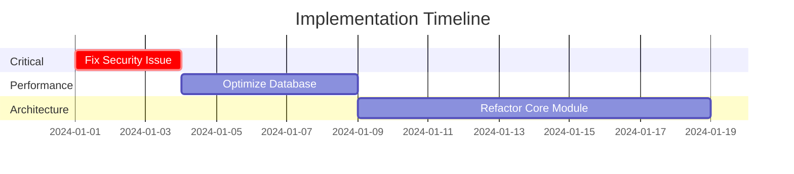

# 상세 보고서 템플릿 (분석/설계 에이전트용)

## 적용 대상 에이전트
- analyzer-spark
- designer-spark
- troubleshooter-spark
- estimater-spark
- loader-spark
- explainer-spark
- documenter-spark

## 템플릿 구조

```markdown
# [작업 유형] Report: [Task Name]

## Executive Summary
- **Agent**: [agent-name]
- **Date**: [ISO-8601 timestamp]
- **Task**: [Original task description]
- **Complexity Score**: [0.0-1.0]
- **Critical Findings**: [Number]
- **Recommended Actions**: [Number]

## 1. System Overview / Project Analysis
### Architecture/Structure Analysis
- Current architecture pattern
- Component relationships
- Data flow analysis
- Dependency graph insights

### Metrics
- Total files analyzed: [number]
- Lines of code: [number]
- Complexity metrics: [details]
- Technical debt: [estimation]

## 2. Detailed Findings

### 2.1 Critical Issues (P0)
[For each critical issue:]
- **Issue**: [Description]
- **Location**: [file:line]
- **Evidence**: [Code snippet or metrics]
- **Impact**: [Business/Technical impact]
- **Recommended Fix**: [Specific solution]
- **Effort**: [Hours/Days]

### 2.2 High Priority Issues (P1)
[Similar structure]

### 2.3 Medium Priority Issues (P2)
[Similar structure]

## 3. Analysis by Domain

### Performance Analysis
- **Bottlenecks Identified**: 
  - [Component]: [Issue] - [Impact]
- **Optimization Opportunities**:
  - [Area]: [Potential improvement] - [Expected gain]

### Security Analysis
- **Vulnerabilities Found**: [List with OWASP categories]
- **Authentication/Authorization Issues**: [Details]
- **Data Protection Gaps**: [Details]

### Code Quality Analysis
- **Design Patterns**: [Used vs Recommended]
- **Anti-patterns Detected**: [List with locations]
- **Code Duplication**: [Percentage and locations]
- **Test Coverage Gaps**: [Areas needing tests]

## 4. Risk Assessment
- **Technical Risks**: [High/Medium/Low with details]
- **Scalability Concerns**: [Current vs Future]
- **Maintenance Burden**: [Current state]
- **Security Exposure**: [Risk level]

## 5. Recommendations

### Immediate Actions (This Sprint)
1. [Action] - [Impact] - [Effort]
2. [Action] - [Impact] - [Effort]

### Short-term Improvements (1-2 Sprints)
1. [Improvement] - [Expected outcome]
2. [Improvement] - [Expected outcome]

### Long-term Strategic Changes (Quarterly)
1. [Strategic change] - [Business value]
2. [Strategic change] - [Business value]

## 6. Implementation Roadmap


## 7. Metrics Dashboard
- **Current State Score**: [0-100]
- **Target State Score**: [0-100]
- **Improvement Potential**: [%]
- **ROI Estimation**: [Value/Effort]

## 8. Evidence & Artifacts
- Analysis scripts used: [List]
- Tools employed: [List]
- Raw data location: [Path]
- Supporting documents: [Links]

## 9. Next Steps for Other Agents
- **For implementer-spark**: [Specific tasks]
- **For tester-spark**: [Testing priorities]
- **For improver-spark**: [Refactoring targets]

## Appendix
- Detailed code snippets
- Full dependency graphs
- Complete metrics tables
- Extended technical notes
```

## 사용 지침
1. 보고서 위치: `/docs/agents-task/[agent-name]/[task_name]_[timestamp].md`
2. 최소 분량: 500-800줄 (에이전트에 따라 다름)
3. 모든 섹션 필수 작성
4. 증거 기반 작성 (파일 경로, 라인 번호 포함)